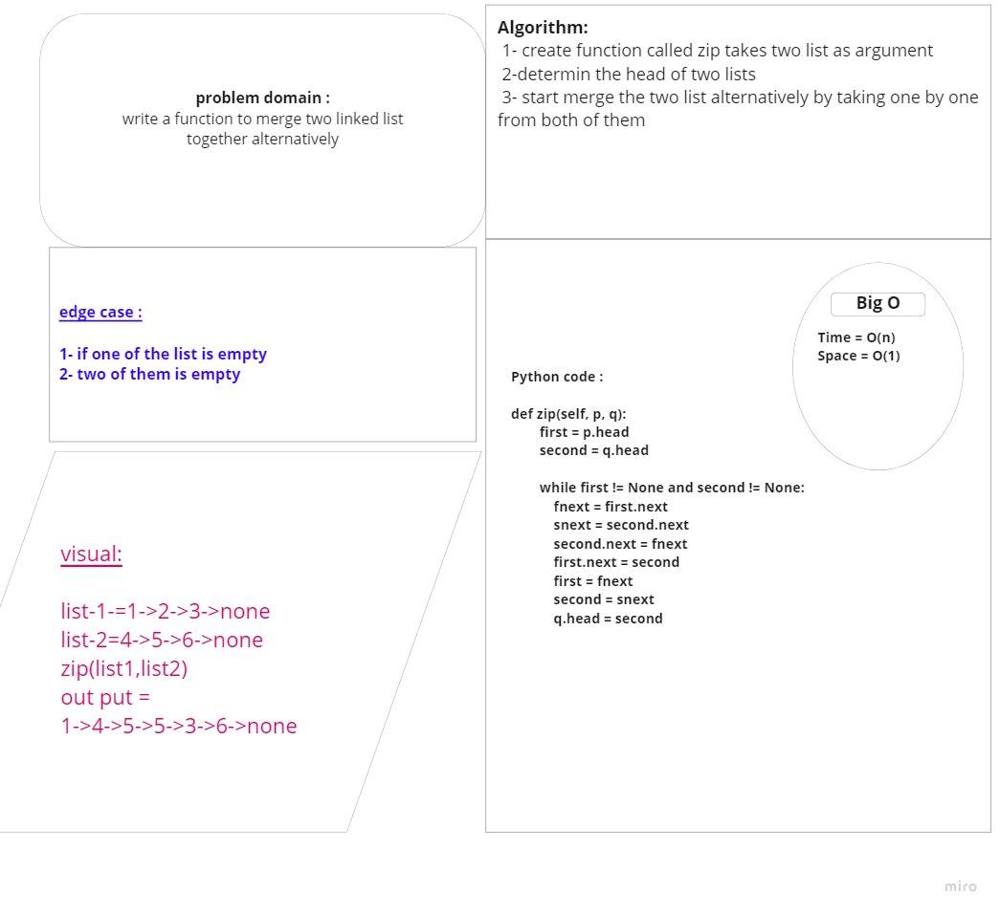

# Challenge:

write function called zip which takes two linked lists as arguments. merge them into one
takes the nodes alternate between both lists and return a zipped list

# Approach & Efficiency

function take two linked list, cheack if one of the linked list is empty or both of them  
create while loop while thelinked lists node are not none while will check each node not equal none then insert to the new list
after that return the list of the node as new linked list

# Big O:

Time = O(n)
space = O(n)

# code :

def zip(self, p, q):
first = p.head
second = q.head

        while first != None and second != None:
            fnext = first.next
            snext = second.next
            second.next = fnext
            first.next = second
            first = fnext
            second = snext
            q.head = second

# whiteboared:

