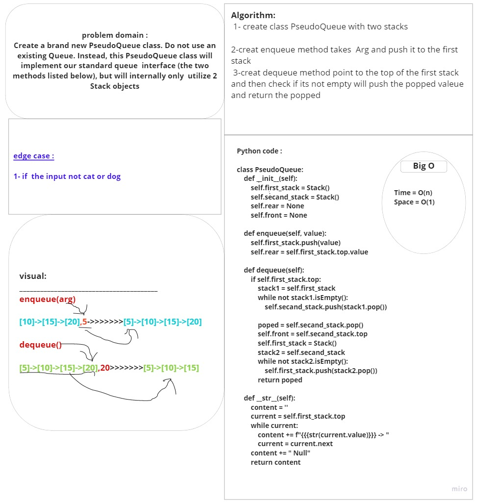

# Challenge Summary
<!-- Description of the challenge -->
Create a brand new PseudoQueue class. Do not use an existing Queue. Instead, this PseudoQueue class will implement our standard queue interface (the two methods listed below), but will internally only utilize 2 Stack objects
## Whiteboard Process
<!-- Embedded whiteboard image -->

## Approach & Efficiency
<!-- What approach did you take? Why? What is the Big O space/time for this approach? -->
for input a value to the pseudoqueue all values are popped into a second stack, the value  pushed to the top of the second stack and then  popped from the second stack back to the first stack. and for dequeueing  value from the pseudoqueue the top of the first stack popped
## Solution
<!-- Show how to run your code, and examples of it in action -->
class PseudoQueue:
    def __init__(self):
        self.first_stack = Stack()
        self.secand_stack = Stack()
        self.rear = None
        self.front = None

    def enqueue(self, value):
        self.first_stack.push(value)
        self.rear = self.first_stack.top.value

    def dequeue(self):
        if self.first_stack.top:
            stack1 = self.first_stack
            while not stack1.isEmpty():
                self.secand_stack.push(stack1.pop())

            poped = self.secand_stack.pop()
            self.front = self.secand_stack.top
            self.first_stack = Stack()
            stack2 = self.secand_stack
            while not stack2.isEmpty():
                self.first_stack.push(stack2.pop())
            return poped
###########################################################
## PR link:
 https://github.com/Talafhamohammad-cloud/data-structures-and-algorithms-python/pull/21            