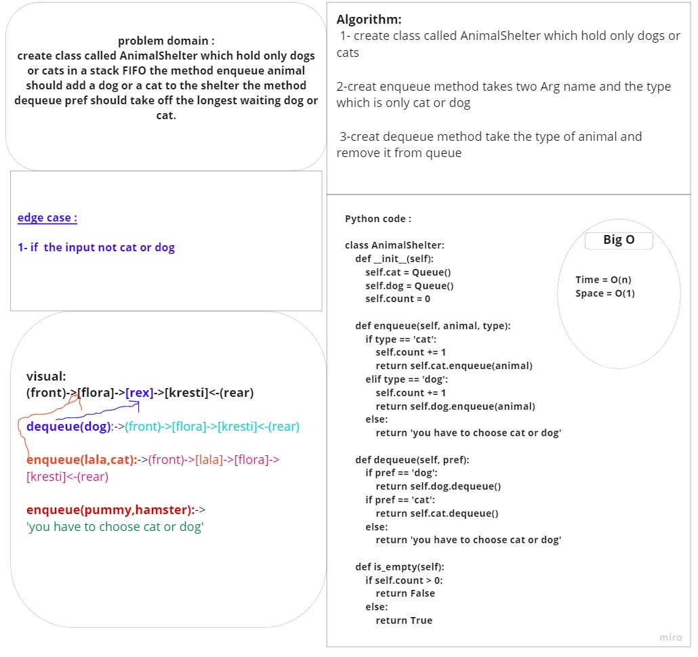

# First-in, First out Animal Shelter:
Create a class called AnimalShelter which holds only dogs and cats 
The shelter operates using a first-in, first-out approach.

## Challenge:
create class called AnimalShelter which hold only dogs or cats in a stack FIFO the method enqueue animal should add a dog or a cat to the shelter the method dequeue pref should take off the longest waiting dog or cat.

# Whiteboard:

## Approach & Efficiency
 -Big O :
  -time : O(n)
  -space : O(1)
## Solution:
(front)->[flora]->[rex]->[kresti]<-(rear)

dequeue(dog):->(front)->[flora]->[kresti]<-(rear)

enqueue(lala,cat):->(front)->[lala]->[flora]->[kresti]<-(rear)

enqueue(pummy,hamster):->
'you have to choose cat or dog'

## PR link :

