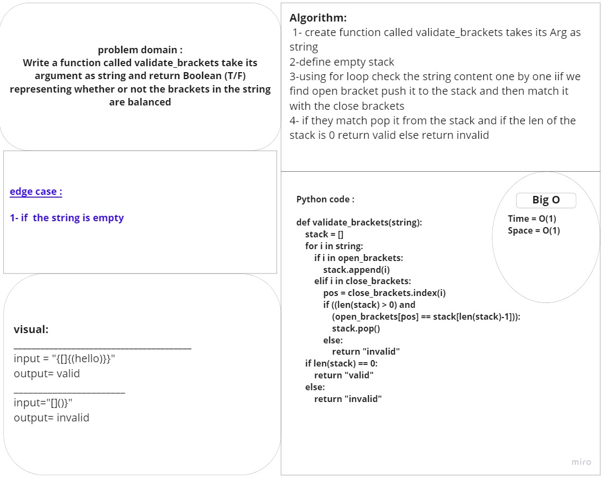

# Challenge Summary
Write a function called validate_brackets take its argument as string and return boolian (T/F) 
representing whether or not the brackets in the string are balanced

## Whiteboard Process

## Approach & Efficiency:
check balanced parentheses useing stack. Each time, when an open parentheses is encountered push it in the stack, and when closed parenthesis is encountered, match it with the top of stack and pop it. If stack is empty at the end, return valid otherwise, invalid.
***for Big O:***
-time : O(1)
-space : O(1)
## Solution:
def validate_brackets(string):
    stack = []
    for i in string:
        if i in open_brackets:
            stack.append(i)
        elif i in close_brackets:
            pos = close_brackets.index(i)
            if ((len(stack) > 0) and
                (open_brackets[pos] == stack[len(stack)-1])):
                stack.pop()
            else:
                return "invalid"
    if len(stack) == 0:
        return "valid"
    else:
        return "invalid"

## PR link:
