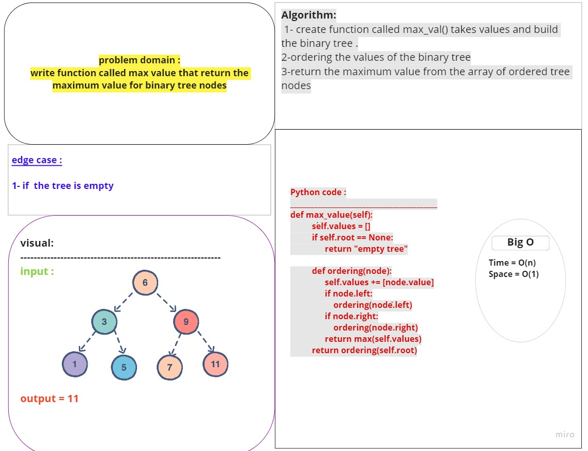

# Trees:
In the data structure, a tree is a type of nonlinear data structure that consists of nodes that are connected. A tree typically has a single root node which indicates the starting point of the data structure.

Trees are one of the most challenging topics to learn in data structures and programming. Application-wise, trees are typically used for efficient data storage and fast traversal and indexing when searching for data.

## Challenge:
Create a Node class that has properties for the value stored in the node, the left child node, and the right child node.
Binary Tree
Create a Binary Tree class
Define a method for each of the depth first traversals:
pre order
in order
post order which returns an array of the values, ordered appropriately.
Create a Binary Search Tree class
This class should be a sub-class (or your languages equivalent) of the Binary Tree Class, with the following additional methods:
Add
Arguments: value
Return: nothing
Adds a new node with that value in the correct location in the binary search tree.
Contains
Argument: value
Returns: boolean indicating whether or not the value is in the tree at least once.

## Approach & Efficiency:
    -pre order: time O(n), space O(n)
    -in order: time O(n), space O(n)
    -post order: time O(n), space O(n)
    -Add: time O(logn), space O(1)
    -Contains: time O(logn), space O(1)

## API:
***-Pre order: method that return tree in order*** < root=> left=> right >
***-In order: method that return tree in order*** < left=> root=> right >
***-Post order: method that return tree in order*** < left=> right=> root >
***-Add: to add a value to a tree by BST ALG***
***-Contains: to check if the value exist in the tree or not***
## PR link:
https://github.com/Talafhamohammad-cloud/data-structures-and-algorithms-python/pull/26 

###################################################################################################
##############################   code challenge-16 (max-tree)          ############################
###################################################################################################
# Challenge Summary
adding new method to the binary tree class that will find the maximum value in given numaric tree 
## Whiteboard Process

## Approach & Efficiency
the approche i worked in that i taked the values of the tree after traverse and put them in an array
and take the max value of that array 
Big O:
Time: O(n)
Space: O(1)

## Solution

def max_value(self):
          self.values = []
          if self.root == None:
                return "empty tree"

          def ordering(node):
                self.values += [node.value]
                if node.left:
                    ordering(node.left)
                if node.right:
                    ordering(node.right)
                return max(self.values)
          return ordering(self.root)
# PR link:
https://github.com/Talafhamohammad-cloud/data-structures-and-algorithms-python/pull/28
