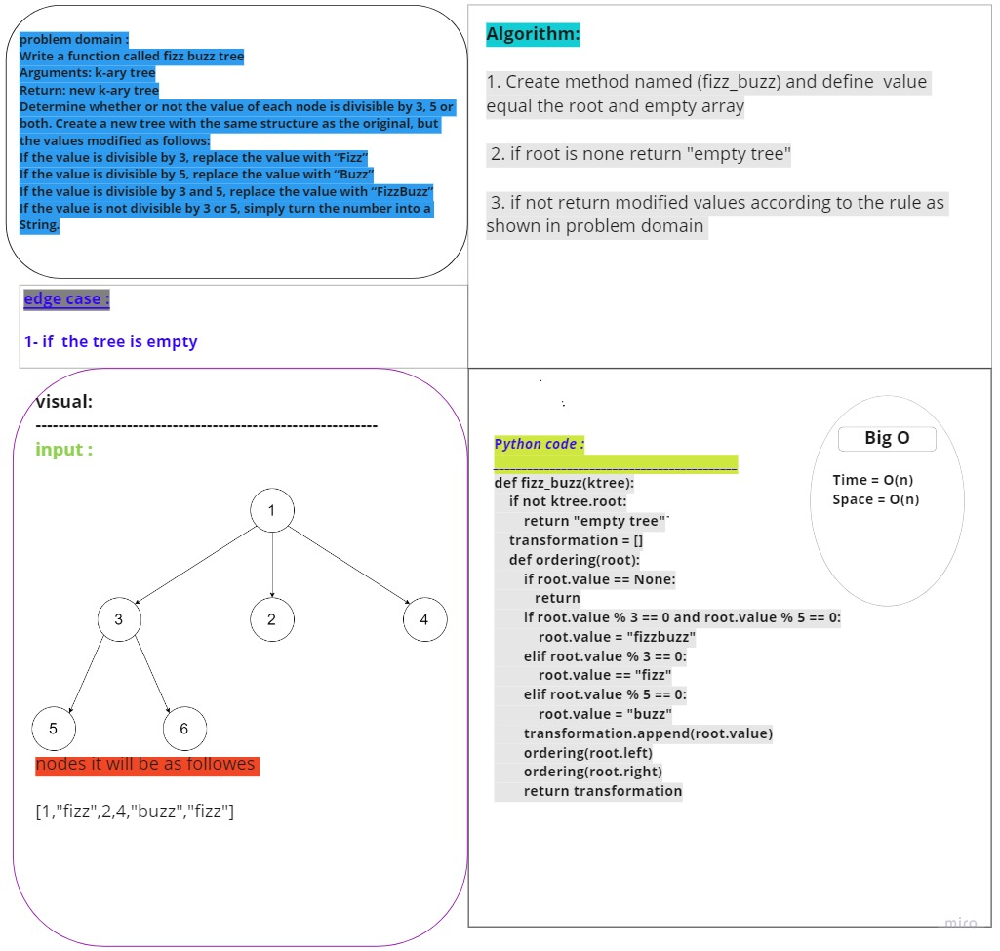

# Challenge Summary
<!-- Description of the challenge -->
Write a function called fizz buzz tree
Arguments: k-ary tree
Return: new k-ary tree
Determine whether or not the value of each node is divisible by 3, 5 or both. Create a new tree with the same structure as the original, but the values modified as follows:
If the value is divisible by 3, replace the value with “Fizz”
If the value is divisible by 5, replace the value with “Buzz”
If the value is divisible by 3 and 5, replace the value with “FizzBuzz”
If the value is not divisible by 3 or 5, simply turn the number into a String.
## Whiteboard Process
<!-- Embedded whiteboard image -->

## Approach & Efficiency
<!-- What approach did you take? Why? What is the Big O space/time for this approach? -->
time O(n)
space O(n)
## Solution
<!-- Show how to run your code, and examples of it in action -->
def fizz_buzz(ktree):
    if not ktree.root:
        return "empty tree"
    transformation = []
    def ordering(root):
        if root.value == None:
           return
        if root.value % 3 == 0 and root.value % 5 == 0:
            root.value = "fizzbuzz"
        elif root.value % 3 == 0:
            root.value == "fizz"
        elif root.value % 5 == 0:
            root.value = "buzz"
        transformation.append(root.value)
        ordering(root.left)
        ordering(root.right)
        return transformation