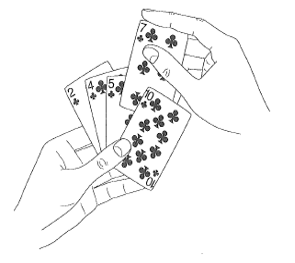
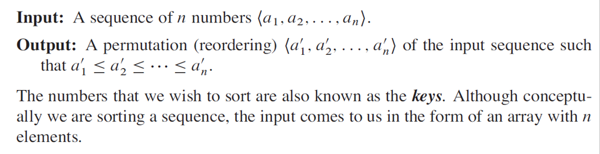
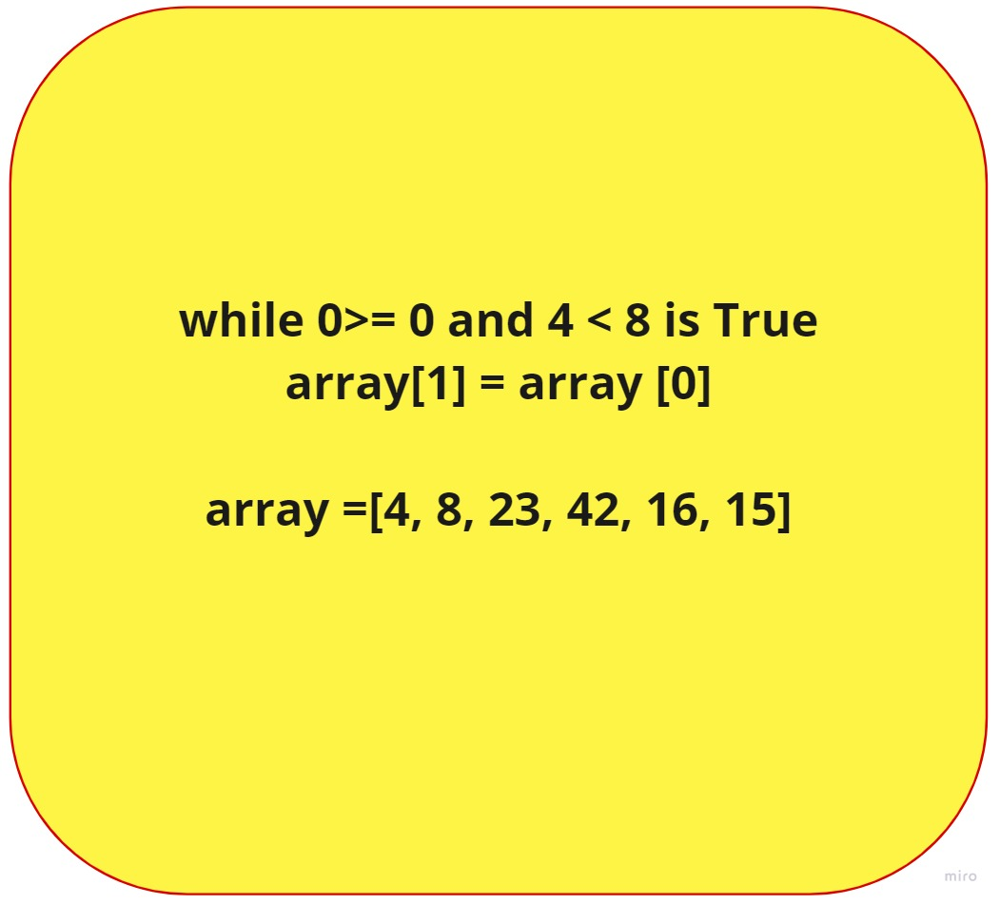
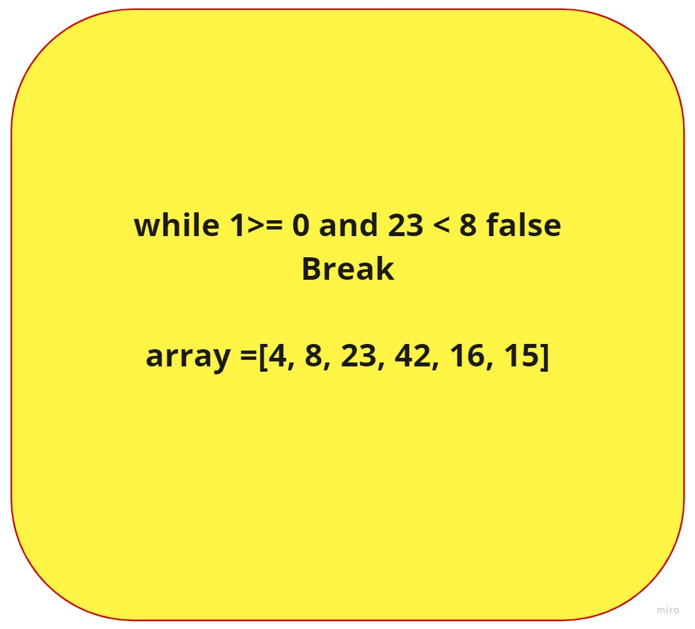
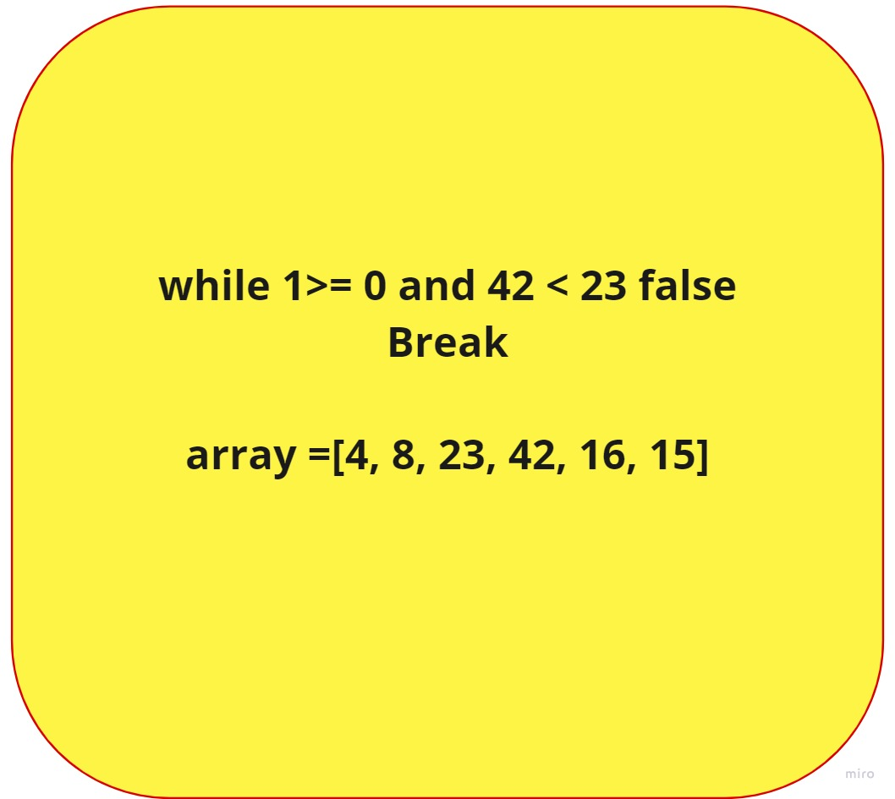
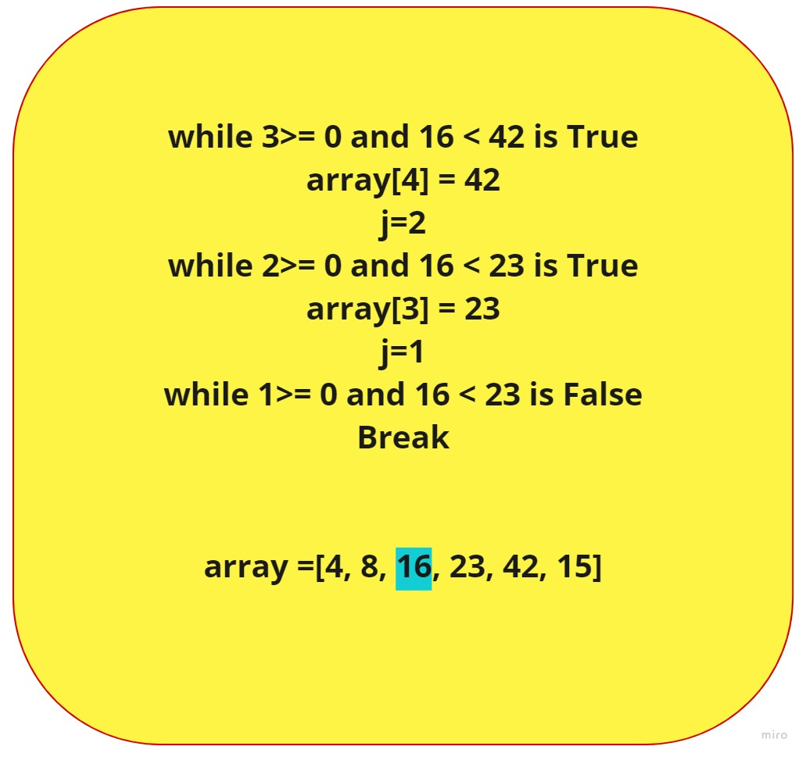
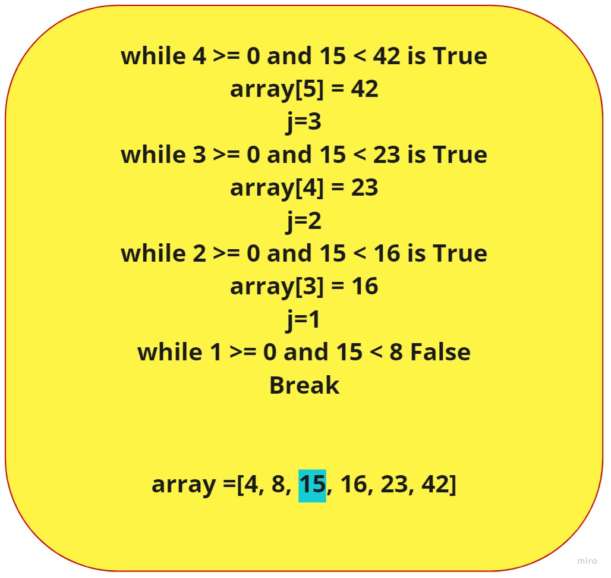

# Insertion sort :
Insertion sort works the way many people sort a hand of playing cards
We start with an empty left hand and we insert one card at a time into the correct position in the left hand.

# Pseudocode :
     InsertionSort(int[] arr)

     FOR i = 1 to arr.length

      int j <-- i - 1
      int key <-- arr[i]

      WHILE j >= 0 AND key < arr[j]
        arr[j + 1] <-- arr[j]
        j <-- j - 1

      arr[j + 1] <-- key
# Trace :
Sample Array is:

[8 , 4 , 23 , 42 , 16 , 15]

## pass1:
when: (i=1 , j=0 , key=4)

## pass2:
when: (i=2 , j=1 , key=23)

## pass3:
when: (i=3 , j=2 , key=42)

## pass4:
when: (i=4 , j=3 , key=16)

## pass5:
when: (i=5 , j=4 , key=15)

# the final result will be : [4, 8, 15, 16, 23, 42] 

# Efficency:

In the best case the running time is
T(n)=an+b
which is linear in n.

In the worst case the running time is 
T(n)=an2+bn+c
which is a quadratic function of n.

the best notation for input space depends on the problem being studied is :
vector containing numbers so the space will be 
Space = O(1)

