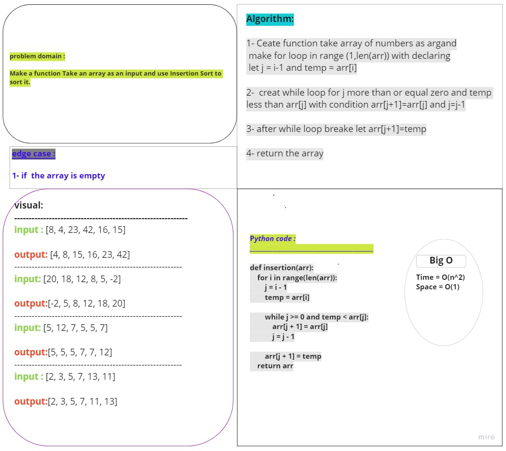

# Challenge Summary
<!-- Description of the challenge -->
## Make a function Take an array as an input and use Insertion Sort to sort it.

## Whiteboard Process
<!-- Embedded whiteboard image -->

## Approach & Efficiency
<!-- What approach did you take? Why? What is the Big O space/time for this approach? -->
#### Incremental approach
***Insertion sort uses an incremental approach:***

having sorted the sub-array A[1..j −1], we insert the single element A[ j ] into its proper place, yielding the sorted subarray A[1 . . j ].

Time = O(n^2)

space = O(1)

## Solution
<!-- Show how to run your code, and examples of it in action -->
     def insertion(arr):
      for i in range(len(arr)):
        j = i - 1
        temp = arr[i]

        while j >= 0 and temp < arr[j]:
            arr[j + 1] = arr[j]
            j = j - 1

        arr[j + 1] = temp
    return arr

# PR LINK:
https://github.com/Talafhamohammad-cloud/data-structures-and-algorithms-python/pull/36 
