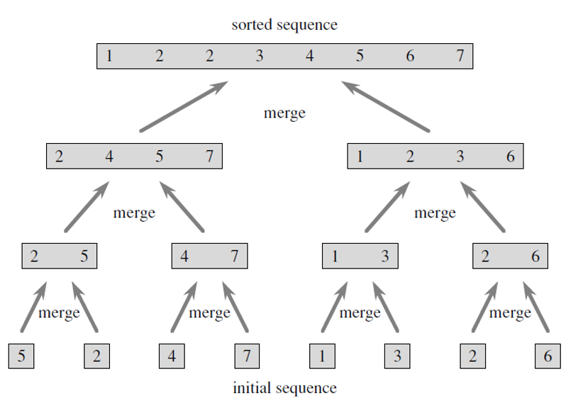
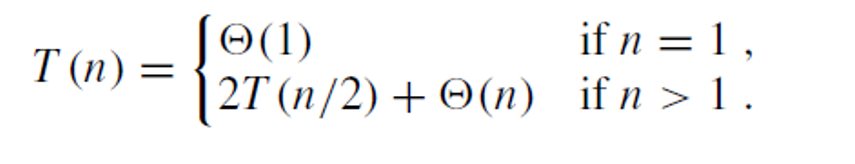

# Merge sort :
To perform the merging, we use an auxiliary procedure Merge(A,p,q,r) where
A is an array, p,q,r are indices of elements in the array, 
such that p≤q<r and the subarrays A[p..q] and A[q+1..r] are in sorted order
It merges them to form a single sorted subarray that replaces the current subarray A[p..r].
Basic idea: Suppose we have two piles of cards face up on a table. Each pile is sorted, with the smallest cards on top.
We choose the smaller of the two cards on top of the face-up piles, removing it from its pile, placing this card face down onto the output pile. 
We repeat this step until one input pile is empty
We take the remaining input pile and place it face down onto the output pile.

# Pseudocode :
    ALGORITHM Mergesort(arr)
    DECLARE n <-- arr.length

    if n > 1
      DECLARE mid <-- n/2
      DECLARE left <-- arr[0...mid]
      DECLARE right <-- arr[mid...n]
      // sort the left side
      Mergesort(left)
      // sort the right side
      Mergesort(right)
      // merge the sorted left and right sides together
      Merge(left, right, arr)

    ALGORITHM Merge(left, right, arr)
    DECLARE i <-- 0
    DECLARE j <-- 0
    DECLARE k <-- 0

    while i < left.length && j < right.length
        if left[i] <= right[j]
            arr[k] <-- left[i]
            i <-- i + 1
        else
            arr[k] <-- right[j]
            j <-- j + 1

        k <-- k + 1

    if i = left.length
       set remaining entries in arr to remaining values in right
    else
       set remaining entries in arr to remaining values in left

# Trace :

  

  the whole idea is to split it into several parts and then start merge each part alone 
  and so on till we reache sorted array imagin that like building pyramid 
  
  keep compine the parts togother 
  till we reach the head of the pyramid which is our sorted array 

# Efficency:

We assume that the number n of keys to sort is a perfect power of 2.
For T(n) (the time required to sort n numbers we write a recursion formula:
Divide: determines the middle of the list: konstant time
Conquer: solve two subproblems of size n/2 which contributes by 2T(n/2) to the running time
Combine: for n elemnts MERGE has running time cn.
Thus:

And T(n)=(nlog(n))
