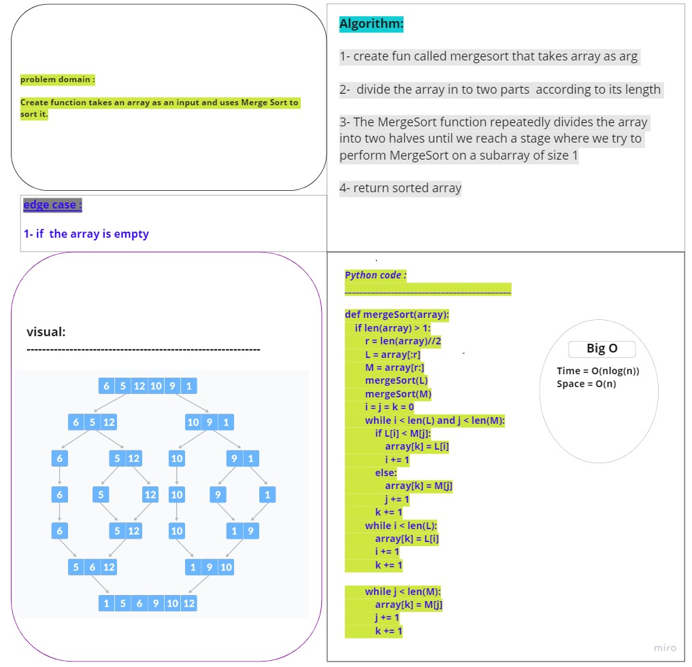

# Challenge Summary
<!-- Description of the challenge -->
Create function takes an array as an input and uses Merge Sort to sort it.
## Whiteboard Process
<!-- Embedded whiteboard image -->

## Approach & Efficiency
<!-- What approach did you take? Why? What is the Big O space/time for this approach? -->
Recursive (divide-and-conquerre):

We break the problem into several sub-problems that are similar to the original problem but smaller in size, solve the sub-problems recursively, and then combine these solutions to create a solution to the original problem
The merge sort algorithm is a recursive algorithm
- Time = O(nlog(n))
- space = O(n)

## Solution
<!-- Show how to run your code, and examples of it in action -->
     def mergeSort(array):
     if len(array) > 1:
        r = len(array)//2
        L = array[:r]
        M = array[r:]
        mergeSort(L)
        mergeSort(M)
        i = j = k = 0
        while i < len(L) and j < len(M):
            if L[i] < M[j]:
                array[k] = L[i]
                i += 1
            else:
                array[k] = M[j]
                j += 1
            k += 1
        while i < len(L):
            array[k] = L[i]
            i += 1
            k += 1

        while j < len(M):
            array[k] = M[j]
            j += 1
            k += 1

# PR link:            

https://github.com/Talafhamohammad-cloud/data-structures-and-algorithms-python/pull/38 
