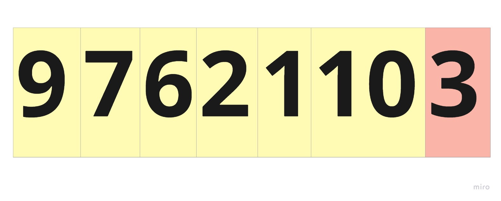
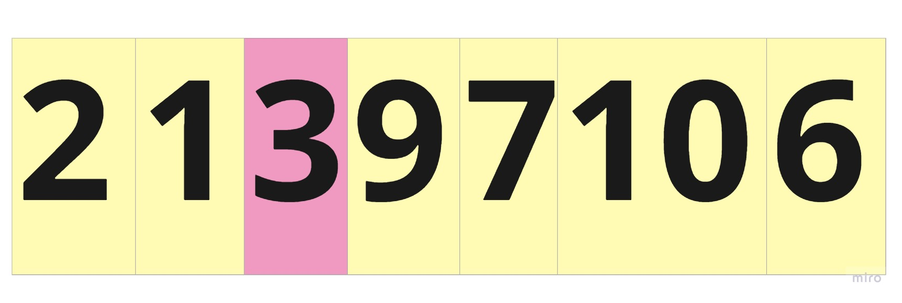
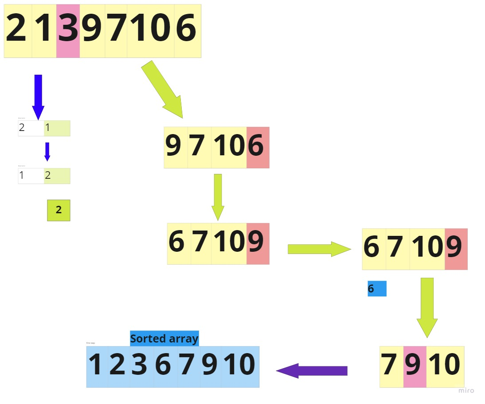

# quick sort:
Quicksort is a sorting algorithm based on the divide and conquer approach where
An array is divided into subarrays by selecting a pivot element (element selected from the array).
While dividing the array, the pivot element should be positioned in such a way that elements less than pivot are kept on the left side and elements greater than pivot are on the right side of the pivot.
The left and right subarrays are also divided using the same approach. This process continues until each subarray contains a single element.
At this point, elements are already sorted. Finally, elements are combined to form a sorted array.

# PseudoCode:

     ALGORITHM QuickSort(arr, left, right)
      if left < right
        // Partition the array by setting the position of the pivot value
        DEFINE position <-- Partition(arr, left, right)
        // Sort the left
        QuickSort(arr, left, position - 1)
        // Sort the right
        QuickSort(arr, position + 1, right)

      ALGORITHM Partition(arr, left, right)
     // set a pivot value as a point of reference
     DEFINE pivot <-- arr[right]
     // create a variable to track the largest index of numbers lower than the defined pivot
     DEFINE low <-- left - 1
     for i <- left to right do
        if arr[i] <= pivot
            low++
            Swap(arr, i, low)

     // place the value of the pivot location in the middle.
     // all numbers smaller than the pivot are on the left, larger on the right.
     Swap(arr, right, low + 1)
     // return the pivot index point
     return low + 1

     ALGORITHM Swap(arr, i, low)
     DEFINE temp;
     temp <-- arr[i]
     arr[i] <-- arr[low]
     arr[low] <-- temp

# TRACE :
1. Select the Pivot Element:
here in this approche i choose the last element of the array 
sample example array :

array = [ 9 , 7 , 6 , 2 , 1 , 10 , 3]

2. Rearrange the Array

Now the elements of the array are rearranged so that elements that are smaller than the pivot are put on the left and the elements greater than the pivot are put on the right.

3. Divide Subarrays

Pivot elements are again chosen for the left and the right sub-parts separately. And, step 2 is repeated.
till we get sorted array as shown below

# Efficency:

The quicksort has running time O(n2) in the worst case, but its average running time is O(n lg n) (with very good hidden constants) and it sorts in place
It occurs when the pivot element picked is either the greatest or the smallest element.
This condition leads to the case in which the pivot element lies in an extreme end of the sorted array. One sub-array is always empty and another sub-array contains n - 1 elements. Thus, quicksort is called only on this sub-array.

