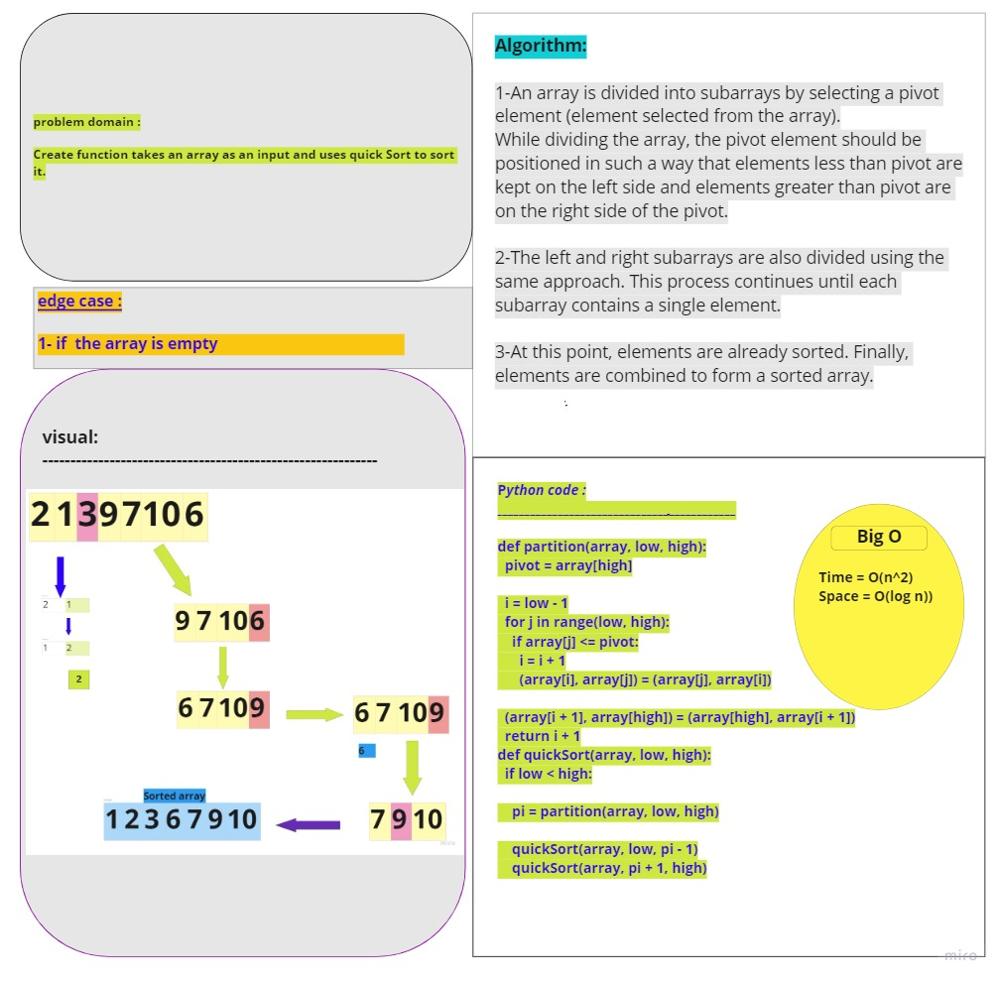

# Challenge Summary
creat function that will take an array as arg and return sorted array in quick sort method 

## Whiteboard Process

## Approach & Efficiency
The quicksort has running time O(n2) in the worst case, but its average running time is O(n lg n) (with very good hidden constants) and it sorts in place
It occurs when the pivot element picked is either the greatest or the smallest element.
This condition leads to the case in which the pivot element lies in an extreme end of the sorted array. One sub-array is always empty and another sub-array contains n - 1 elements. Thus, quicksort is called only on this sub-array.

## Solution

     def quickSort(array, low, high):
     if low < high:

     pi = partition(array, low, high)

     quickSort(array, low, pi - 1)
     quickSort(array, pi + 1, high)

# PR LINK :
https://github.com/Talafhamohammad-cloud/data-structures-and-algorithms-python/pull/41
